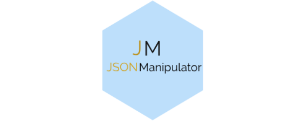
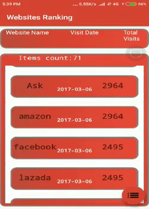
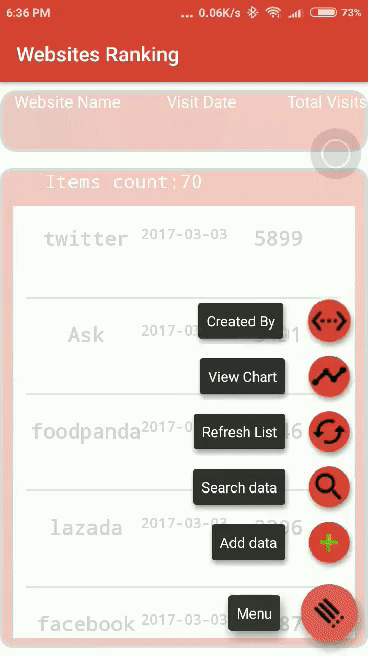
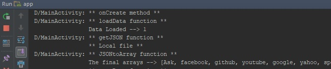

# websiteRanking

[](https://waffle.io/sxaxmz/websiteRanking)



This project is a template of an Android app that allows the user to manipulate a set of JSON parsed data through a UI and perform simple analytics such as chart view. The code can be modified to match any JSON data-set in any context, this repository contains a data-set that covers a website ranking based on number of visitors data-set as a sample to demonstrate the application capabilities.

  

### Analytics Tools:

  - [x] Chart view.
  - [x] Search data-set.
  - [x] Add data.
  - [x] Data-set sort and manipulation.
  
### Modification Examples:

  * To-Do list.
  * Grocery list analytics behaviour.
  * Analytics tool for 3rd party app/web service.
  
### Integrate:
  * Fork repository.
  * Modify the source path.
     The input stream for current repository context: 
	 
```
	InputStream is = getAssets().open("websiteRanking.json");  
```  

  * Modify the file name to your source name to keep track.
     As the app creates a local copy of the file to aloow the user to view it later or to modify it without affecting the original file. The local file name is defined as a string:
	 
``` 
	String fileName = "websiteRanking.json";
```

  * Modify the JSON Objects attributes to match your source.
     The JSON Objects for current repository context: 
	 
```
	String siteId = jsonObject.getString("id_website");
	String siteName = jsonObject.getString("website_name");
	String visitDate = jsonObject.getString("visit_date");
	String visitors = jsonObject.getString("total_visits");
```

  * JSON items and adapter.
     Modify the JSON items array and adapter to match your source:
	 
```  
	myRVA.java
	items.java
```

  * Chart attributes:
     Arrays that will be used to initialize the chart:
  
```  
	public static String[] siteName;
	public static float[] visitors;
```

     Function to fill the data accordingly into the arrays:

```
	public void JSONtoArray () {
```

     In-order to change the chart design/look:
	 
```  
	chartActivity.java
```

### Debug:
There is no need to use any debug tools in-case of modification/enhancement to the application. As the application contains Logs before executing any function, were those logs will assist when facing any difficulty.
	
```
	Log.d("ActivityName", "Executed Function/method");
```
Example of the applciation logs: 



### Usage:
When using/modifying this application or the source code of this application always do give appropriate credit. In-case of using this application of the source code of this applciation in commercial or monetary situations do always ask for permission and give appropriate creditas.
  
##### Logo created by [LogoMakr](https://logomakr.com)